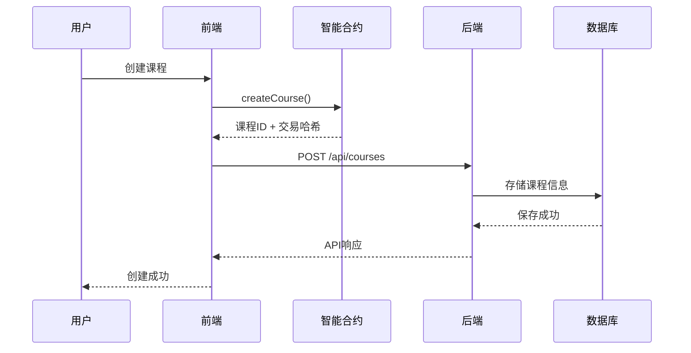
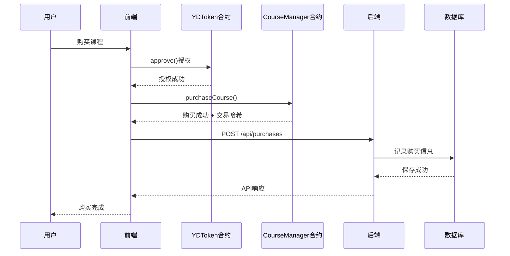
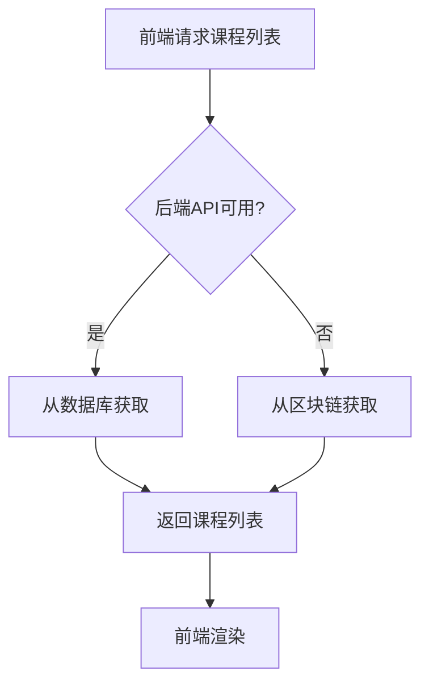

# 🏗️ Web3教育平台 - 项目架构总览

## 📅 更新时间: 2025年1月9日

## 🎯 项目概述

Web3教育平台是一个去中心化的在线课程平台，结合了区块链技术与传统Web2的优势，为用户提供安全、透明的在线学习体验。

## 🏛️ 整体架构

```
                    Web3 教育平台架构图
                         
    ┌─────────────────┐    ┌─────────────────┐    ┌─────────────────┐
    │   前端应用      │    │   后端API      │    │   区块链网络    │
    │                 │    │                 │    │                 │
    │  React 18       │◄──►│  Express.js     │◄──►│  Sepolia 测试网 │
    │  TypeScript     │    │  TypeScript     │    │                 │
    │  TailwindCSS    │    │  MySQL 8.0      │    │  智能合约       │
    │  Ethers.js      │    │  Docker         │    │  • YDToken      │
    │  Zustand        │    │                 │    │  • CourseManager│
    │                 │    │                 │    │  • SimpleStaking│
    └─────────────────┘    └─────────────────┘    └─────────────────┘
         localhost:5176         localhost:3001        Sepolia Network
```

## 🔧 技术栈详情

### 前端技术栈
```typescript
// 核心框架
React 19.1.1            // UI框架
TypeScript 5.x          // 静态类型检查
Vite 7.1.2             // 构建工具

// 样式与UI
TailwindCSS 4.1.13     // CSS框架
CSS-in-JS              // 组件样式

// Web3集成
ethers.js 6.15.0       // 以太坊交互库
MetaMask               // 钱包连接

// 状态管理
Zustand 5.0.8          // 轻量级状态管理
React Context          // 钱包状态管理

// 路由
React Router DOM 7.8.2 // 客户端路由
```

### 后端技术栈
```typescript
// 服务器框架
Node.js 20.x           // 运行时环境
Express.js             // Web服务器框架
TypeScript 5.x         // 静态类型检查

// 数据库
MySQL 8.0              // 关系型数据库
MySQL2                 // Node.js MySQL驱动
Docker                 // 容器化部署

// 开发工具
nodemon                // 热重载
ts-node                // TypeScript运行
pnpm                   // 包管理器

// 安全与中间件
CORS                   // 跨域资源共享
dotenv                 // 环境变量管理
```

### 区块链技术栈
```solidity
// 智能合约
Solidity 0.8.28        // 合约开发语言
OpenZeppelin 5.4.0     // 安全合约库

// 开发框架
Hardhat 3.0.4          // 合约开发框架
TypeScript             // 类型安全
Viem 2.37.5           // 合约测试库

// 网络
Sepolia Testnet        // 以太坊测试网络
Etherscan             // 区块浏览器验证
```

## 📁 项目目录结构

```
edu3-university/
├── contracts/                   # 智能合约 (Hardhat)
│   ├── contracts/
│   │   ├── YDToken.sol         # ERC20代币合约
│   │   ├── CourseManager.sol   # 课程管理合约
│   │   └── SimpleStaking.sol   # 质押合约
│   ├── ignition/               # 部署脚本
│   ├── test/                   # 合约测试
│   └── hardhat.config.ts       # Hardhat配置
│
├── frontend/                    # React前端应用
│   ├── src/
│   │   ├── components/         # UI组件
│   │   ├── hooks/              # 自定义Hook
│   │   │   ├── useContracts.ts # 智能合约交互
│   │   │   └── useWallet.ts    # 钱包管理
│   │   ├── context/            # React Context
│   │   ├── services/           # API服务层
│   │   │   └── api.ts          # 后端API调用
│   │   ├── pages/              # 页面组件
│   │   └── types/              # TypeScript类型
│   ├── abis/                   # 合约ABI文件
│   └── vite.config.ts          # Vite配置
│
├── backend/                     # Express后端服务
│   ├── src/
│   │   ├── server.ts           # 主服务器文件
│   │   ├── database.ts         # 数据库配置
│   │   └── routes/             # API路由
│   │       ├── courses.ts      # 课程API
│   │       ├── users.ts        # 用户API
│   │       └── purchases.ts    # 购买记录API
│   ├── docker-compose.yml      # Docker配置
│   └── tsconfig.json           # TypeScript配置
│
└── docs/                        # 项目文档
    ├── 任务.md                  # 开发任务清单
    ├── 合约.md                  # 智能合约文档
    ├── 后端开发进度.md          # 后端开发详情
    └── 项目架构总览.md          # 本文档
```

## 🔗 数据流架构

### 1. 课程创建流程


### 2. 课程购买流程


### 3. 数据获取策略


## 🗄️ 数据库设计

### 核心数据表
```sql
-- 用户表
users
├── id (BIGINT, PRIMARY KEY)
├── wallet_address (VARCHAR(42), UNIQUE)  # 钱包地址
├── nickname (VARCHAR(50))                # 昵称
├── bio (TEXT)                           # 个人简介
├── created_at (TIMESTAMP)
└── updated_at (TIMESTAMP)

-- 课程表
courses
├── id (BIGINT, PRIMARY KEY)
├── course_id (VARCHAR(50))              # 区块链课程ID
├── instructor_address (VARCHAR(42))      # 讲师地址
├── title (VARCHAR(200))                 # 课程标题
├── description (TEXT)                   # 课程描述
├── price_yd (DECIMAL(18,8))            # YD代币价格
├── tx_hash (VARCHAR(66))               # 创建交易哈希
└── created_at (TIMESTAMP)

-- 购买记录表
purchases
├── id (BIGINT, PRIMARY KEY)
├── user_address (VARCHAR(42))           # 购买用户地址
├── course_id (VARCHAR(50))              # 课程ID
├── tx_hash (VARCHAR(66))               # 购买交易哈希
├── price_paid (DECIMAL(18,8))          # 支付价格
└── created_at (TIMESTAMP)
```

## 🔐 安全架构

### 1. 智能合约安全
- ✅ OpenZeppelin安全库
- ✅ 重入攻击防护
- ✅ 整数溢出保护
- ✅ 权限控制机制

### 2. Web2安全
- ✅ CORS跨域配置
- ✅ 时间戳验证（防重放）
- 🔄 MetaMask签名验证（基础）
- ✅ SQL注入防护（参数化查询）

### 3. 前端安全
- ✅ 输入验证
- ✅ 钱包连接状态检查
- ✅ 网络检查（Sepolia）
- ✅ 交易确认机制

## 🌐 API接口设计

### RESTful API规范
```typescript
// 课程管理
GET    /api/courses                    # 获取课程列表
POST   /api/courses                    # 创建课程
POST   /api/courses/:id/details        # 获取课程详情(需签名)

// 用户管理  
GET    /api/users/:address             # 获取用户信息
POST   /api/users/profile              # 更新用户资料(需签名)

// 购买记录
POST   /api/purchases                  # 记录购买
GET    /api/purchases/user/:address    # 获取用户购买记录

// 系统接口
GET    /api/health                     # 健康检查
GET    /api/test                       # 连接测试
```

### 响应格式标准
```typescript
// 成功响应
{
  "success": true,
  "data": { ... },
  "message": "操作成功"
}

// 错误响应
{
  "success": false,
  "error": "错误描述",
  "code": "ERROR_CODE"
}
```

## 📊 智能合约架构

### 合约关系图
```
    YDToken (ERC20)
         ↑
    ┌────┴────┐
    │         │
CourseManager SimpleStaking
    ↓         ↓
  课程管理   代币质押
```

### 主要合约功能
```solidity
// YDToken.sol - ERC20代币
- mint()        // 铸造代币
- transfer()    // 转账
- approve()     // 授权

// CourseManager.sol - 课程管理
- createCourse()    // 创建课程
- purchaseCourse()  // 购买课程  
- hasPurchased()    // 检查购买状态

// SimpleStaking.sol - 质押系统
- stake()           // 质押代币
- unstake()         // 取消质押
- calculateReward() // 计算收益(1%/日)
```

## 🚀 部署架构

### 开发环境
```yaml
前端: localhost:5176    # Vite开发服务器
后端: localhost:3001    # Express服务器  
数据库: localhost:3306  # MySQL Docker容器
区块链: Sepolia网络     # 以太坊测试网
```

### 生产环境规划
```yaml
前端: Vercel/Netlify    # 静态站点部署
后端: Railway/Heroku    # 容器化部署
数据库: 云数据库        # MySQL云服务
CDN: CloudFlare         # 全球加速
```

## 📈 性能优化

### 前端优化
- ✅ Vite构建优化
- ✅ 组件懒加载
- ✅ 状态管理优化
- 🔄 图片资源优化

### 后端优化  
- ✅ 数据库连接池
- ✅ 查询索引优化
- ✅ API降级策略
- 🔄 Redis缓存（规划）

### 区块链优化
- ✅ Gas费用优化
- ✅ 批量操作支持
- ✅ 事件日志监听
- 🔄 Layer2扩容（规划）

## 🎯 项目里程碑

### ✅ 第一阶段: 基础设施 (已完成)
- 智能合约开发与部署
- 前端框架搭建  
- 后端API开发
- 数据库设计实现

### 🔄 第二阶段: UI组件 (进行中)
- 页面组件开发
- 用户交互设计
- 响应式布局
- 错误处理优化

### 🔮 第三阶段: 生产部署 (规划中)
- 生产环境配置
- 性能监控
- 安全加固
- 用户文档

## 📝 技术债务

### 当前待解决
1. **签名验证完善**: ethers.verifyMessage实现
2. **错误边界处理**: React错误边界组件
3. **日志系统**: 结构化日志记录
4. **测试覆盖**: 单元测试和集成测试

### 未来优化
1. **缓存系统**: Redis缓存热门数据
2. **CDN部署**: 静态资源加速
3. **监控告警**: 服务健康监控
4. **自动化部署**: CI/CD流水线

---

## 🏆 总结

Web3教育平台成功实现了：

🎯 **混合架构**: 区块链透明性 + 传统数据库性能  
🔐 **安全可靠**: 多层安全防护机制  
⚡ **高性能**: 降级策略保证可用性  
🛠️ **可扩展**: 模块化设计便于维护  
📱 **用户友好**: 现代化UI/UX设计  

**当前项目完成度: 70%**  
**距离生产就绪: 预计2-3天**

这是一个技术先进、架构合理的Web3教育平台！🚀